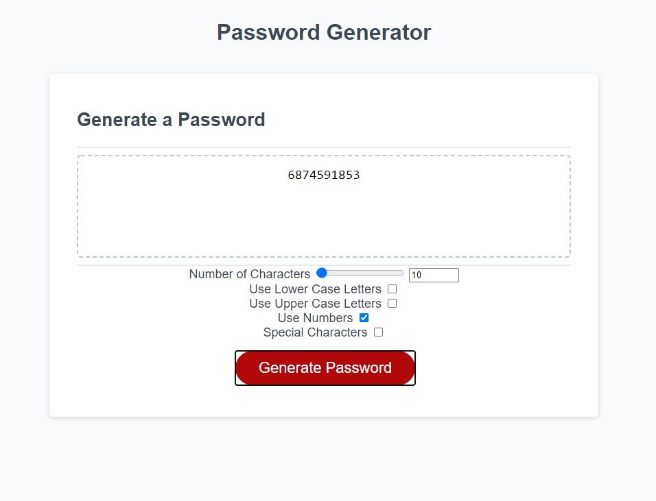
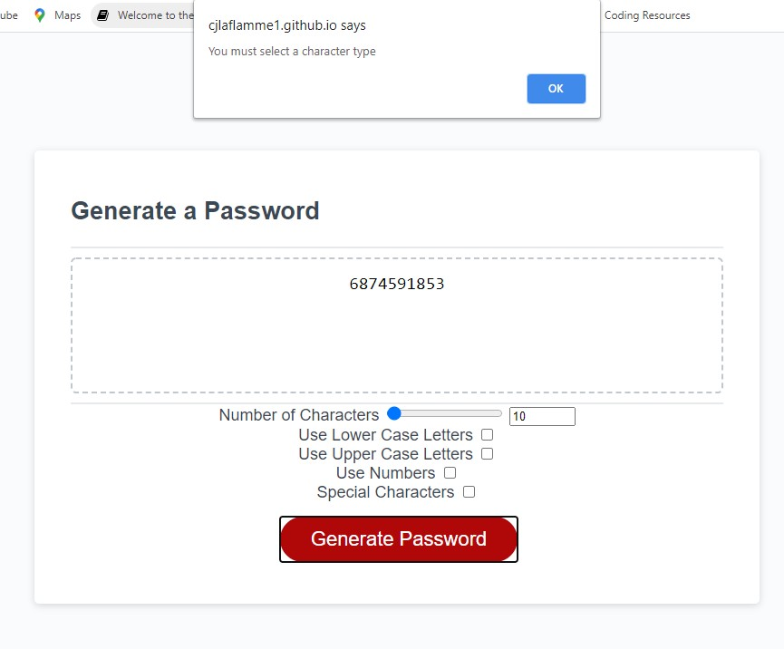
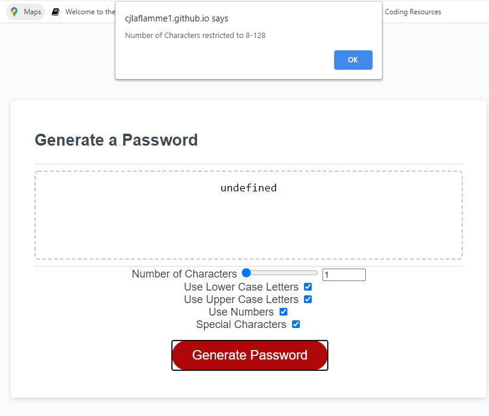

# 03_JavaScript_Password_Generator

## Homework #3

### About the Project

In this assignment, we were tasked with creating a password generator from a preexisting HTML and CSS page.  The generator has to provide options for various password content, length, and free of errors. 

[Link to Website](https://cjlaflamme1.github.io/03_JavaScript_Password_Generator/)

### Biggest Challenges

For this project I had to do a lot of research to better understand the process and functions required for a password generator.  There are many demonstrations and tutorials available but I tried to stick with what made the most sense for me.  

1. Password Selection Array: There seems to be several ways to create an array with the available characters array.  I found the most straight forward was to create a string and then split into an array.  

2. Password generator function: The other primary objective was necessarily difficult logically, but to keep everything organized and clean.  I tried to group each part of the process together so that my lengthy function, was easy to decipher by outside eyes.  

3. Password Restrictions: I also had to create restrictions to maintain a minimum of character types, and keep the range within 8-128 characters.  Alerts will pop up if a password is attempted outside of these restrictions, and exit the function.  

### Screenshot

#### Error Message 1

#### Error Message 2

